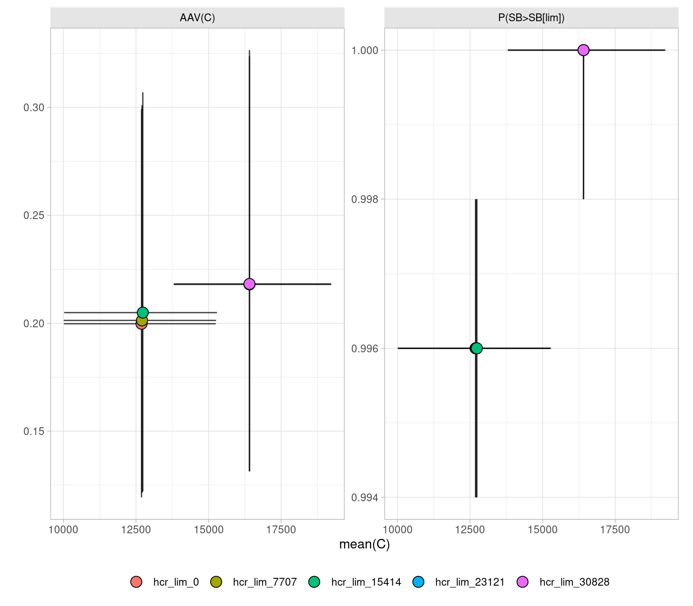

```{r knitr, include = FALSE}
library(knitr)
opts_chunk$set(
  collapse = TRUE,
  comment = "#>",
  out.width="92%",
  eval=FALSE
)
```

```{r setup, echo=FALSE, eval=TRUE}
library(mse)

# INTERMEDIATE year
iy <- 2023

# DATA year
dy <- iy - 1

# FINAL year
fy <- 2042

# NUMBER of iterations
it <- 500
```

# Installation

The latest version of the required [FLR](https:://flr-project.org) packages, and all their dependencies, can be installed from the [FLR R-universe page](https://flr.r-universe.dev) by calling:

```{r install}
install.packages("icesTAF")

install.packages(icesTAF::deps(), repos=c(
  FLR="https://flr.r-universe.dev",
  CRAN="https://cloud.r-project.org/"))
```

They can also be installed from the source code in the [FLR github repositories](https://github.com/flr) by calling

```{r installgithub}
remotes::install_github(paste0("flr/", c("FLCore", "ggplotFL", "FLFishery", "FLasher", "FLSRTMB", "mse", "mseviz")))
```

# Setup

Updates on the progress of the analysis can be obtained through the [progressr](https://progressr.futureverse.org/) package, which is already available as a dependency to [mse](https://flr-project.org/mse). Please use the following command to request all progress output to be shown. This applies to calls to functions *mp*, *mps* and *bootstrapSR*.

```{r progressr}
handlers(global=TRUE)
```

A parallel backend can be specified, setup using any of those that work with the 'future' package, each scenario will be run on separate cores or nodes. The example above, executed over 5 cores on a laptop computer, took 3 minutes to finalise.

# TAF repository

## bootstrap/initial

The essential inputs for the analysis include the result of the stock assessment model fit and the current set of reference points.

For example, `bootstrap/initial/data/sol274.rda` contains the following objects:

- `run`: The latest AAP stock assessment for sol.27.4 (WGNSSK 2023), as an object or class `FLStock`. The object does not reflect the WGNSSK 2023 sol.27.4 assessment, as it has been artificially depleted for demonstration purposes.

- `refpts`: An object of class `FLPar` containing the reference points, biological and operational, calculated for this stock in the last benchmark (ICES, 2020).

Uncertainty in past dynamics and initial conditions might have been already quantified, for example by employing the McMC sampling procedure available in the stock assessment model, by bootstrap of model inputs, or through a ensemble of model fits. If that is the case, the conditioning steps in `data.R` should be adapted accordingly. 

# OM conditioning, `data.R`

From the stock assessment run, or a set of chosen ensemble runs, an operating model (OM) is to be constructed to evaluate the alternative advice rules by introducing some of the potential uncertainty in future dynamics, in this case in recruitment.

First, one or multiple stock-recruitment relationships are fitted to the data, and then to bootstrapped series of the stock-recruits pairs, following the approach applied in ICES to category 1 stocks [@ICESrefpts_2022].

```{r bootstrap}
fits <- srrTMB(as.FLSRs(run, models=c("bevholt", "segreg")), 
  spr0=mean(spr0y(run)))

srpars <- bootstrapSR(run, iters=it,
  models=c("bevholt", "segreg"), method="best")
```

Models are fitted by the `r ``srrTMB` function in package [FLSRTNB](https://flr-project.org/FLSRTMB/), which employs steepness and virgin biomass formulations of the models but returns the converted parameters in the standard *a* and *b* parameters. The multiple stock-recruit relationships are combined into a meta-model, called `mixedsrr`, in which a third parameter (*m*) determines what model is applied on each iteration: 1 for Beverton & Holt, 2 for Ricker and 3 for segmented regression.

An `FLom` object can now be assembled. This is the *FLR* representation of an operating model for a single stock and fishery, and contains all that is required for projecting the stock forward under different management regimes.

```{r om}
om <- FLom(stock=propagate(run, it), refpts=refpts, model='mixedsrr',
  params=srpars, deviances=srdevs)
```

This call builds the object with the initial population (*run*), propagated or replicated for the desired number of iterations (*it*), the matching biological reference points (*refpts*), the SRR to be applied and the set of parameters obtained from the bootstrap step (*model* and *params*), and the deviances to apply over the future recruitment estimates. These have been generated in this case following a log-normal distribution, with variance and autocorrelation computed from the bootstrap analysis.

```{r loadbootstrap, echo=FALSE, eval=TRUE}
load("data/bootstrap.rda")
load("data/data.rda")
```

```{r srdevs, eval=TRUE}
srdevs <- rlnormar1(sdlog=srpars$sigmaR, rho=srpars$rho, years=seq(dy, fy))
```

```{r plotsrdevs, echo=FALSE, eval=TRUE}
plot(srdevs)
```

The OM can now be extended until the final year (*fy*). The default call to `fwdWindow()` sets both future biology (weights, maturity and natural mortality) and fishery dynamics (selectivity and discards ratio) to remain as the average of the last 3 years in the model run

```{r fwdwindow}
om <- fwdWindow(om, end=fy)
```

Other options exist for determining future values and patterns in any assumed quantity. For example, values can be resampled from a number of recent years, or different number of years can be used to compute the future average values. For example, this alternative call found the *trove.R* file, uses an averages of the last five years, except for weights-at-age, in stock, landings, discards and catch, which are instead resampled over the same period. Future values in the *om* object can also be modified directly.

```{r omsample}
om <- fwdWindow(window(om, end=2023), end=fy, nsq=5,
  fun=c("mean", wt="sample"))
```

An Observation Error Model is then set that contains past stock observations and adds future deviances to be applied to future data collection. In this case, lognormal errors in catch.n, with $SD=0.2$ were added.

```{r oem}
oem <- FLoem(
  observations=list(stk=stock(om)),
  deviances=list(stk=FLQuants(catch.n=rlnorm(500, catch.n(om) %=% 0, 0.2))),
  method=perfect.oem
)
```

# Evaluation of recovery rules, `model.R`

To construct a baseline level for comparing the candidate recovery procedures, a projection under a full fishery closure ($\bar{F} = 0$) can be carried out.

```{r runf0}
runf0 <- fwd(om, control=fwdControl(year=seq(2024, 2042), quant="fbar",
  value=0))
```

```{r plotrunf0, echo=FALSE, eval=TRUE}
plot(runf0) +
  geom_vline(xintercept=2023.5, linetype=2, color='gray')
```

Recovery rules, or any other management procedure (MP), are composed of a number of steps for which modules can be specified in an object of the `mpCtrl` class. The rules under analysis for WKREBUILD2 consist of three elements:

1. An estimation method (*est*): a shortcut module substitutes the stock assessment method, with added deviances in the estimate of stock status (`SSBdevs`).

2. A Harvest Control Rule (*hcr*): a hockeystick HCR with four variables (limit, minimum, target and trigger) is set up, using SSB as input and F as output.

3. An implementation system (*isys*): this step implements the short-term forecast used to convert the F given by the HCR into a TAC value to be used on the advice year. The method sets future biology and selectivity to match the recent (3 years) averages, computes past observed recruitment to obtain a geometric mean to apply in the projection, adds deviances to the fishing mortalities applied to the stock, and carries out the forecast to obtain the corresponding catch level. The intermediate year assumption is that of fishing mortality being equal to the last observed year, but the alternative assumption of catch equal to the set TAC could be added if necessary.

These three steps are specified in a control structure, as follows:

```{r, eval=TRUE}
arule <- mpCtrl(list(
  # shortcut.sa + SSBdevs
  est = mseCtrl(method=shortcut.sa,
    args=list(SSBdevs=sdevs$SSB)),
  # hockeystick as ICES
  hcr = mseCtrl(method=hockeystick.hcr,
    args=list(lim=0, trigger=refpts(om)$Btrigger, target=refpts(om)$Fmsy,
    min=0, metric="ssb", output="fbar")),
  #
  isys = mseCtrl(method=tac.is,
    args=list(recyrs=30, fmin=0, Fdevs=sdevs$Fdevs))))
```

This `mpCtrl` object implements the ICES advice rule with biomass trigger and F target levels taken from the *eqsim*-based calculations of the last benchmark for this stock. 

```{r}
plot_hockeystick.hcr(arule$hcr, labels=c(trigger="MSYBtrigger", limit="",
  min="", target="Ftarget")) + xlab("SSB") + ylab("F")
```

Applying the MP specified by such a control structure requires a call to the *mp()* function with the OM, OEM and control objects as main arguments. Only one extra argument is required, a list containing at least the starting year of the simulation (*iy*). By default the simulation will run to the last year of the 'om' object (*fy*), on an annual basis (*frq*), and with one year of lag in both data (*data_lag*) and decision implementation (*management_lag*). Running an MP that sets advice for a three-year period, for example, only requires passing the corresponding value in the list, `r  list(iy=2023, frq=3)`.

```{r mseargs}
mseargs <- list(iy=2023, fy=2042, data_lag=1, management_lag=1, frq=1)
```

We now proceed to run the MP applying on the ICES advice rule and a shortcut approach to the stock assessment.

```{r advice}
advice <- mp(om, iem=iem, ctrl=arule, args=mseargs)
```

The result of a call to *mp()* is returned as an object of class `FLmse`, which contains the projected OM, the `mpCtrl` (*control*), argument list (*args*) and OEM (*oem*) objects used for it, and an array that reports on the decisions made and values applied at every step (*tracking*). For example, the OM biomass, the *estimate* of it 

```{r}
tracking(advice)[c('SB.om', 'met.hcr', 'decision.hcr', 'hcr',
  'fbar.isys', 'isys'), ac(2024:2026)]
```

A set of runs can now be conducted in which the standard advice rule is modified in various ways. For example, a range of values are explored for the *lim* argument: the level of the input metric (SSB in this case) at which the output (F) is set to the *min* value. Five between 0 and the value of *Blim* for sol.27.4 were chosen in this example. To run these alternative MPs, the 'mps' function takes the same arguments as a call for a single MP, but also a list of alternative values for one of more of the HCR arguments, for example

```{r limopts}
limopts <- mps(om, ctrl=arule, args=mseargs,
  hcr=list(lim=seq(0, c(refpts(om)$Blim), length=5)))
```

Combinations of alternative arguments can be specified more easily by calling the `combinations` function, for example

```{r combinations}
opts <- combinations(
  lim=seq(0, c(refpts(om)$Btrigger) * 0.50, length=3),
  min=c(0, 0.05))
```

This list can now be used in the call to `mps()`

```{r plans}
plans <- mps(om, ctrl=arule, args=mseargs, hcr=opts)
```

# Computing and summarizing performance, `output.R`

- The performance of alternative MPs is evaluated by specifying a series of performance statistics. Four example statistics have been defined:

  - PBlim: Probability of SSB is above Blim.
  - C: Mean catch.
  - AVVC: Average annual variability in catch.
  - risk: ICES Risk 2, probability that spawner biomass is above Blim once

- Performance statistics are defined as a list containing a formula to compute it, a name, and a description. Formulas can make use or existing or new functions. Additional statistics can be easily formulated following these examples. Elements in the formula must refer to aither fefrenec points in the 'erfpts' slot of the OM, e.g. 'Blim', or to metrics defined in the call to 'performance()'. For example, `C=catch`.

```{r, eval=FALSE}
icesstats <- list(

  # P(SB>SBlim)
  PBlim=list(~iterMeans((SB/Blim) > 1), name="P(SB>SB[lim])",
    desc="Probability that spawner biomass is above Blim"),

  # mean(C)
  C=list(~yearMeans(C), name="mean(C)",
    desc="Mean catch over years"),

  # AVVC
  AAVC=list(~yearMeans(abs(C[, -1] - C[, -dim(C)[2]])/C[, -1]),
    name="AAV(C)", desc="Average annual variability in catch"),

  # P(SB < SBlim) at least once
  risk2=list(~yearMeans(iterMeans(((SB/Blim) < 1) > 0)),
    name="once(P(SB<B[limit]))",
    desc="ICES Risk 2, probability that spawner biomass is above Blim once")
)
```

- The 'performance' function computes the specified statistics making use of the specified metrics and reference points. A set of metrics is defined by default for OM objects: SB for ssb, F for fbar and C for catch. The time period over which performance is to be computed is also specified. This can be either individual years or a period of them over which to compute a mean or median

```{r, eval=FALSE}

# COMPUTE yearly performance statistics
perf_byear <- performance(runs, statistics=stats[-3], years=2023:2041)

# COMPUTE final performance statistics (2023-2041)
perf_end <- performance(runs, statistics=stats, years=list(2035:2041))
```

# Generating graphical outputs, `report.R`

- A number of plot functions are available for displaying the results of the MP runs. For example, plots of the time series

- The 'mseviz' package provides a set of plot functions that attempt to compare the performance of alternative MPs on some chosen. For example boxplots of each performance metric by MP

```{r perf_bps, echo=FALSE}
include_graphics("report/perf_bps.png")
```

- Also of trade-offs of a statistics, typically catch, against others

```{r perf_tos, echo=FALSE}

```

# Specific functions, `utilities.R`

- A number of functions are currently defined in the `utilities.R` file. any function of general application will be incorporated into any of the FLR packages being used. ICES-specific functions should be integrated into an MSE-related package, or on any of the existing ICEs R package, if suitable.

# Alternative steps, `trove.R`


# Reproducibility and version control

Once an analysis is running, the mechanisms of TAF should be used to keep track of what package versions were used. This ensures the reproducibility of the whole analysis.

If packages have been installed from the [FLR github](https://github.com/flr) repositories, the `bootstrap/SOFTWARE.bib` file storing all version info can be created by calling

```{r}
flrpkgs <- c("FLCore", "FLFishery", "FLasher", "mse", "ggplotFL",
  "mseviz", "FLSRTMB")

icesTAF::draft.software(flrpkgs, file=TRUE)
```

If packages have been installed from [r-universe](https://flr.r-universe.dev), we can add the version information using the following (experimental) code.

```{r runiverse}

flrpkgs <- c("FLCore", "FLFishery", "FLasher", "mse", "ggplotFL",
  "mseviz", "FLSRTMB")

bib <- lapply(flrpkgs, function(x) {
  
  bib <- draft.software(x)

  return(sub('  source  = \\{\\},', paste0("  source = \\{flr/", x, "@", packageDescription(x)$RemoteSha, "\\},"), bib))
  }
)

file <- file.path(boot.dir(), "SOFTWARE.bib")

write(unlist(bib), file=file, append=FALSE)
```

The `SOFTWARE.bib` file now contains the github commit references to the package versions that were installed from the [FLR r-universe](https://flr.r-universe.dev) repository. A call to `icesTAF::taf.bootstrap(software=TRUE)` would download and install locally those same versions. The file will also ensure that the TAF server in ICES runs on the same versions used locally.

# More information and help


