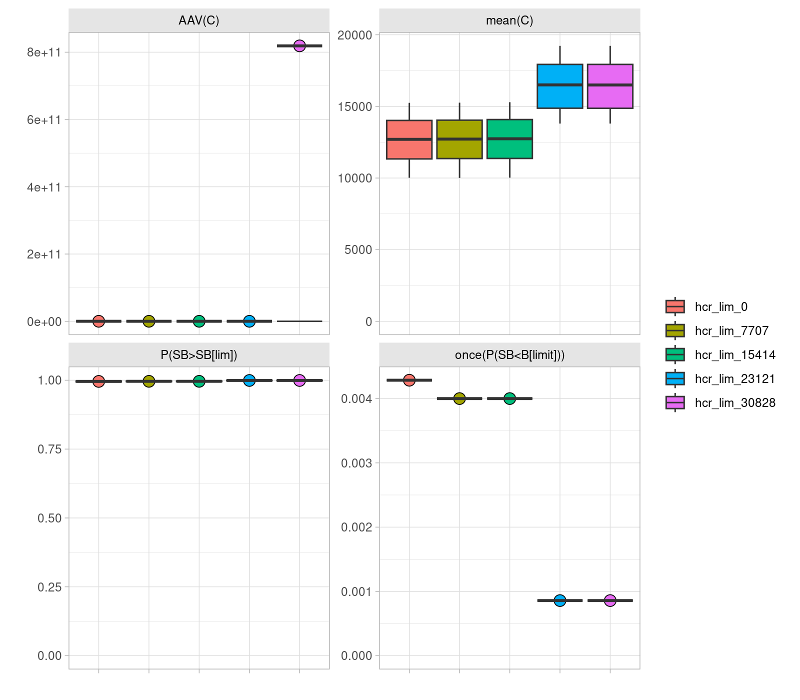

```{r knitr, include = FALSE}
library(knitr)
opts_chunk$set(
  eval=TRUE,
  message=FALSE,
  warning=FALSE,
  collapse = TRUE,
  comment = "#>",
  out.width="92%"
)
```

# Installation

The latest version of the required [FLR](https:://flr-project.org) packages, and all their dependencies, can be installed from the [FLR R-universe page](https://flr.r-universe.dev) by calling:

```r
install.packages("icesTAF")

install.packages(icesTAF::deps(), repos=c(
  FLR="https://flr.r-universe.dev",
  CRAN="https://cloud.r-project.org/"))
```

They can also be installed from the source code in the [FLR github repositories](https://github.com/flr) by calling

```r
remotes::install_github(paste0("flr/", c("FLCore", "ggplotFL", "FLFishery", "FLasher", "FLSRTMB", "mse", "mseviz")))
```

# Setup

## Progress reporting

The [mse](https://flr-project.org/mse) package allows setting up notifications of process on long computations through [progressr](https://progressr.futureverse.org/). You can request a progress bar to be shown for the calls to the `mp()`, `mps()` nd `bootstrapSR` functions in this way

```r
library(progressr)
handlers(global=TRUE)
handlers("progress")
```

## Parallelization

Calls to various functions in the [mse](https://flr-project.org/mse) package (`mp` and `mps`) can be speeded-up through parallelization. For a single `mp()` call, iterations are split in blocks across the number of cores available. In the case of `mps()`, each procedure is executed in a separate process across the available cores.

If the `cores` variable is defined in `data.R` or 'model.R', the call to [plan()](https://future.futureverse.org/reference/plan.html) in `utilities.R` will set up a 'multisession' plan. Please refer to the `plan` help page for further information.

The number of cores to use should be chosen by considering the available memory. Performance will be poor if too many cores are trying to use too little memory.

## Running the code

Once the repository has been cloned, only two steps are necessary to test run the example code, once `icesTAF` has been loaded:

```r
library(icesTAF)

# RUN the repository bootstrap steps (data)
taf.bootstrap()

# SOURCE all R scripts in order
make.all()
```

# TAF repository

## Repository description

A new repository should contain the following folder and tree structure, which includes only initial data files, the corresponding `DATA.bib` file, a BibTeX file with relevant bibliographic references, and the scripts that will run the analysis. These are set based on the example dataset, sol.27.4, and will need to be adapted for a different stock.

```
|-- bootstrap
|   |-- initial
|   |   `-- data
|   |       `-- sol274.rda  - Input dataset
|   |-- references.bib
|   `-- DATA.bib
|-- data.R -  Operating Model conditioning
|-- model.R - Evaluation of Management Procedures
|-- output.R - Quantification of performance, summary outputs
|-- report.R - Plotting
|-- report.Rmd
|-- trove.R - Collection of alternative
`-- utilities.R - Functions developed for this analysis
```


## bootstrap/initial

The essential inputs for the analysis include the result of the stock assessment model fit and the current set of reference points.

For example, `bootstrap/initial/data/sol274.rda` contains the following objects:

- `run`: The latest AAP stock assessment for sol.27.4 (WGNSSK 2023), as an object or class `FLStock`. The object does not reflect the WGNSSK 2023 sol.27.4 assessment, as it has been artificially depleted for demonstration purposes.

- `refpts`: An object of class `FLPar` containing the reference points, biological and operational, calculated for this stock in the last benchmark (ICES, 2020).

Uncertainty in past dynamics and initial conditions might have been already quantified, for example by employing the McMC sampling procedure available in the stock assessment model, by bootstrap of model inputs, or through a ensemble of model fits. If that is the case, the conditioning steps in `data.R` should be adapted accordingly. 

# OM conditioning, `data.R`

From the stock assessment run, or a set of chosen ensemble runs, an operating model (OM) is to be constructed to evaluate the alternative advice rules by introducing some of the potential uncertainty in future dynamics, in this case in recruitment.

First, one or multiple stock-recruitment relationships are fitted to the data, and then to bootstrapped series of the stock-recruits pairs, following the approach applied in ICES to category 1 stocks [@ICESrefpts_2022].

```r
fits <- srrTMB(as.FLSRs(run, models=c("bevholt", "segreg")), 
  spr0=mean(spr0y(run)))

srpars <- bootstrapSR(run, iters=it,
  models=c("bevholt", "segreg"), method="best")
```

Models are fitted by the `r ``srrTMB` function in package [FLSRTNB](https://flr-project.org/FLSRTMB/), which employs steepness and virgin biomass formulations of the models but returns the converted parameters in the standard *a* and *b* parameters. The multiple stock-recruit relationships are combined into a meta-model, called `mixedsrr`, in which a third parameter (*m*) determines what model is applied on each iteration: 1 for Beverton & Holt, 2 for Ricker and 3 for segmented regression.

An `FLom` object can now be assembled. This is the *FLR* representation of an operating model for a single stock and fishery, and contains all that is required for projecting the stock forward under different management regimes.

```r
om <- FLom(stock=propagate(run, it), refpts=refpts, model='mixedsrr',
  params=srpars, deviances=srdevs)
```

This call builds the object with the initial population (*run*), propagated or replicated for the desired number of iterations (*it*), the matching biological reference points (*refpts*), the SRR to be applied and the set of parameters obtained from the bootstrap step (*model* and *params*), and the deviances to apply over the future recruitment estimates. These have been generated in this case following a log-normal distribution, with variance and autocorrelation computed from the bootstrap analysis.

```r
srdevs <- rlnormar1(sdlog=srpars$sigmaR, rho=srpars$rho, years=seq(dy, fy))
```

```{r plotsrdevs}
include_graphics("report/om_deviances.png")
```

The OM can now be extended until the final year (*fy*). The default call to `fwdWindow()` sets both future biology (weights, maturity and natural mortality) and fishery dynamics (selectivity and discards ratio) to remain as the average of the last 3 years in the model run

```r
om <- fwdWindow(om, end=fy)
```

Other options exist for determining future values and patterns in any assumed quantity. For example, values can be resampled from a number of recent years, or different number of years can be used to compute the future average values. For example, this alternative call found the *trove.R* file, uses an averages of the last five years, except for weights-at-age, in stock, landings, discards and catch, which are instead resampled over the same period. Future values in the *om* object can also be modified directly.

```r
om <- fwdWindow(window(om, end=2023), end=fy, nsq=5,
  fun=c("mean", wt="sample"))
```

The following MP runs do not include any error or bias in observations (catch and biological sampling), as a shortcut to the stock assessment is being used to obtain the stock status metrics. A full-feedback evaluation of an MP, in which the stock assessment or any status indicator is computed from catch, biology or survey data, an object of class `FLoem` can be constructed for this purpose. The class contains a method to be applied to observe the OM, add any specified error or bias, and merge those with past observations.

Implementation error can also be incorporated in the evaluation of MPs. An object is assembled containing the choice of implementation dynamics and the levels of error. An approximate 10% error in implementation can be added, for example, through a LN(0, 0.10) distribution as follows.

```r
iem <- FLiem(method=noise.iem,
  args=list(noise=rlnorm(500, rec(om) %=% 0, 0.1)))
```


# Evaluation of recovery rules, `model.R`

To construct a baseline level for comparing the candidate recovery procedures, a projection under a full fishery closure ($\bar{F} = 0$) can be carried out.

```r
runf0 <- fwd(om, control=fwdControl(year=seq(2024, 2042), quant="fbar",
  value=0))
```

```{r plotrunf0, echo=FALSE, eval=TRUE}
include_graphics("report/run_f0.png")
```

Recovery rules, or any other management procedure (MP), are composed of a number of steps for which modules can be specified in an object of the `mpCtrl` class. The rules under analysis for WKREBUILD2 consist of three elements:

1. An estimation method (*est*): a shortcut module substitutes the stock assessment method, with added deviances in the estimate of stock status (`SSBdevs`).

2. A Harvest Control Rule (*hcr*): a hockeystick HCR with four variables (limit, minimum, target and trigger) is set up, using SSB as input and F as output.

3. An implementation system (*isys*): this step implements the short-term forecast used to convert the F given by the HCR into a TAC value to be used on the advice year. The method sets future biology and selectivity to match the recent (3 years) averages, computes past observed recruitment to obtain a geometric mean to apply in the projection, adds deviances to the fishing mortalities applied to the stock, and carries out the forecast to obtain the corresponding catch level. The intermediate year assumption is that of fishing mortality being equal to the last observed year, but the alternative assumption of catch equal to the set TAC could be added if necessary.

These three steps are specified in a control structure, as follows:

```r
arule <- mpCtrl(list(
  # shortcut.sa + SSBdevs
  est = mseCtrl(method=shortcut.sa,
    args=list(SSBdevs=sdevs$SSB)),
  # hockeystick as ICES
  hcr = mseCtrl(method=hockeystick.hcr,
    args=list(lim=0, trigger=refpts(om)$Btrigger, target=refpts(om)$Fmsy,
    min=0, metric="ssb", output="fbar")),
  #
  isys = mseCtrl(method=tac.is,
    args=list(recyrs=30, fmin=0, Fdevs=sdevs$Fdevs))))
```

This `mpCtrl` object implements the ICES advice rule with biomass trigger and F target levels taken from the *eqsim*-based calculations of the last benchmark for this stock. 

```{r advicerule}
include_graphics("report/advice_hcr.png")
```

Applying the MP specified by such a control structure requires a call to the *mp()* function with the OM, OEM and control objects as main arguments. Only one extra argument is required, a list containing at least the starting year of the simulation (*iy*). By default the simulation will run to the last year of the 'om' object (*fy*), on an annual basis (*frq*), and with one year of lag in both data (*data_lag*) and decision implementation (*management_lag*). Running an MP that sets advice for a three-year period, for example, only requires passing the corresponding value in the list, `r  list(iy=2023, frq=3)`.

```r
mseargs <- list(iy=2023, fy=2042, data_lag=1, management_lag=1, frq=1)
```

We now proceed to run the MP applying on the ICES advice rule and a shortcut approach to the stock assessment.

```r
advice <- mp(om, iem=iem, ctrl=arule, args=mseargs)
```

The result of a call to *mp()* is returned as an object of class `FLmse`, which contains the projected OM, the `mpCtrl` (*control*), argument list (*args*) and OEM (*oem*) objects used for it, and an array that reports on the decisions made and values applied at every step (*tracking*). For example, the OM biomass (*SB.om*), the estimate of it used by the HCR (*met.hcr*), the decision taken by the hcr (*decision.hcr*, 1, 2 and 3 for each section of the hockeystick), the output of the HCR (*hcr*), the $\bar{F}$ value used in the short-term forecast (*fbar.isys*), and the catch advice obtained (*isys*).

```{r, echo=FALSE}
load("model/model.rda")
```


```
An object of class "FLQuant"
iters:  500

, , unit = unique, season = all, area = unique

              year
metric         2024                 2025                 2026
  SB.om        2.8064e+04(6.54e+03) 3.8823e+04(1.23e+04) 5.0709e+04(1.68e+04)
  met.hcr      2.8284e+04(7.25e+03) 3.8673e+04(1.28e+04) 5.0080e+04(1.71e+04)
  decision.hcr 2.0000e+00(0.00e+00) 2.0000e+00(0.00e+00) 2.0000e+00(0.00e+00)
  hcr          1.7942e-02(2.02e-02) 2.3047e-02(1.89e-02) 7.5158e-02(6.58e-02)
  fbar.isys    1.7230e-02(2.04e-02) 2.1875e-02(1.89e-02) 7.4639e-02(6.79e-02)
  isys         6.5769e+02(7.74e+02) 1.1701e+03(9.96e+02) 4.8128e+03(4.72e+03)

units:  NA
```

A set of runs can now be conducted in which the standard advice rule is modified in various ways. For example, a range of values are explored for the *lim* argument: the level of the input metric (SSB in this case) at which the output (F) is set to the *min* value. Five between 0 and the value of *Blim* for sol.27.4 were chosen in this example. To run these alternative MPs, the 'mps' function takes the same arguments as a call for a single MP, but also a list of alternative values for one of more of the HCR arguments, for example

```r
limopts <- mps(om, ctrl=arule, args=mseargs,
  hcr=list(lim=seq(0, c(refpts(om)$Blim), length=5)))
```

Combinations of alternative arguments can be specified more easily by calling the `combinations` function, for example

```r
opts <- combinations(
  lim=seq(0, c(refpts(om)$Btrigger) * 0.50, length=3),
  min=c(0, 0.05))
```

This list can now be used in the call to `mps()` to evaluate the resulting six MPs.

```r
plans <- mps(om, ctrl=arule, args=mseargs, hcr=opts)
```

The returned object is a list containing one `FLmse` object for each alternative HCR formulation, which we can plot preceded by the OM

```{r plotplans}
include_graphics("report/plans.png")
```

# Computing and summarizing performance, `output.R`

The performance of alternative MPs is evaluated against a set of performance statistics and for one or more time frames, either continuous or across years.

Two sets of statistics with potential relevance to ICES have been defined in `utilities.R`. The first one (`r ``annualstats`) includes those to be computed on a yearly basis:

- *PBlim*, the probability that spawner biomass is above $B_{lim}$.
- *PBtrigger*, the probability that spawner biomass is above $B_{trigger}$.
- *C*, Mean catch per year.
- *cvC*, CV of catch per year.

Others are to be calculated for a period, or different periods, of years, which are specified in the call to `performance()`. Those currently defined are:
 
- *C*, Mean catch over years.
- *AVVC*, Average annual variability in catch.
- *IACC*, Percentage inter-annual change in catch.
- *risk2*, ICES Risk 2, probability that spawner biomass is above $B_{lim}$ once.
- *firstyear*, First year in which $P(B/B_{lim}) >= 0.95$.

A number of performance statistics are available in the `mse` package, each of them defined by formula, a name and a description.

```{r statistics, eval=FALSE}
data(statistics)

names(statistics)

statistics$risk2
```

Performance across all MP runs can be computed by specifying what statistics to use and over what time period. The *years* argument can set as a vector

```
> performance(c(plans, F0=runf0), statistics=annualstats, years=2023:2041)

   mp    statistic year data     iter name    desc
1: hcr_1 C         2023 4289.200 1    mean(C) Mean catch per year
2: hcr_1 C         2024 3590.629 1    mean(C) Mean catch per year
3: hcr_1 C         2025 5138.519 1    mean(C) Mean catch per year
---
```

in which case the statistics are computed annually. Or it could be of class *list*, and the statistics will be applied over the whole period or periods

```
> performance(c(plans, F0=runf0), statistics=fullstats,
+   years=list(short=2023:2026, long=2023:2041))
   mp    statistic  year  data      iter name   desc
1: hcr_1 AAVC       long  2.278e-01 1    AAV(C) Average annual variability
2: hcr_1 AAVC       long  1.619e-01 2    AAV(C) Average annual variability
3: hcr_1 AAVC       long  1.697e-01 3    AAV(C) Average annual variability
---
```

Note how the initial projection with no catches, *runF0*, gets added to the set of MPs being compared.

Additional performance statistics can be defined as a list containing a formula to compute it, a name, and a description. Formulas can make use or existing or new functions, and refer to either *metrics*, functions that return summary values computed from the OM, or the names of reference points stored in the *refpts* slot. For example, the *risk1* statistics is defined by the formula 
`~yearMeans(iterMeans((SB/SBlim) < 1))`, where `SB` refers to the metric defined to call the `ssb` method, while `SBlim` is one of the reference points defined in the `FLom` object.

# Generating graphical outputs, `report.R`

A number of plot functions are available in the [mseviz](https://flr-project.org/mseviz) package for displaying and comparing the results of the MP runs and the performance statistics. For example boxplots of each multi-annual performance metric by MP can be displayed by calling

```{r plotbps}

```

The `plotOMruns` function present a time series of a single metric (e.g. `ssb`) for the OM, in the top panel, and the various MPs below it.

```{r plotssbruns}
include_graphics("report/onruns.png")
```

# Specific functions, `utilities.R`

A number of functions are currently defined in the `utilities.R` file. any function of general application will be incorporated into any of the FLR packages being used. ICES-specific functions should be integrated into an MSE-related package, or on any of the existing ICES R packages, if suitable.

- *icesmetrics*, a list of relative metrics over ICES reference points.
- *annualstats*, a list of performance statistics to compute yearly.
- *fullstats*, a list of performance statistics to compute over years.
- *firstYear*, a function to compute the first year in which a relative statistic gets to 1.

# Alternative steps, `trove.R`

For a number of steps shown in the example analysis, alternatives already exist using available FLR functions and methods. Please look into the [file](https://github.com/ices-tools-prod/WKREBUILD_toolset/blob/main/trove.R) to see if any could be useful to your case study.

# Reproducibility and version control

Once an analysis is running, the mechanisms of TAF should be used to keep track of what package versions were used. This ensures the reproducibility of the whole analysis.

If packages have been installed from the [FLR github](https://github.com/flr) repositories, the `bootstrap/SOFTWARE.bib` file storing all version info can be created by calling

```r
flrpkgs <- c("FLCore", "FLFishery", "FLasher", "mse", "ggplotFL",
  "mseviz", "FLSRTMB")

icesTAF::draft.software(flrpkgs, file=TRUE)
```

If packages have been installed from [r-universe](https://flr.r-universe.dev), we can add the version information using the following (experimental) code.

```r

flrpkgs <- c("FLCore", "FLFishery", "FLasher", "mse", "ggplotFL",
  "mseviz", "FLSRTMB")

bib <- lapply(flrpkgs, function(x) {
  
  bib <- draft.software(x)

  return(sub('  source  = \\{\\},', paste0("  source = \\{flr/", x, "@", packageDescription(x)$RemoteSha, "\\},"), bib))
  }
)

file <- file.path(boot.dir(), "SOFTWARE.bib")

write(unlist(bib), file=file, append=FALSE)
```

The `SOFTWARE.bib` file now contains the github commit references to the package versions that were installed via the [FLR r-universe](https://flr.r-universe.dev) repository. A call to `icesTAF::taf.bootstrap(software=TRUE)` would download and install those precise versions in the `bootstrap` folder. The file will also be used by the TAF server in ICES to use the same versions when running the code.

# Asking for help

 To report bugs or make suggestions regarding this example, please use the [repository issues](https://github.com/ices-tools-prod/WKREBUILD_toolset/issues?q=is%3Aissue+is%3Aopen+sort%3Aupdated-desc). If the problem is with code in any one particular package, please use the corresponding issue page for its repository at the [FLR github project](https://github.com/flr/).
